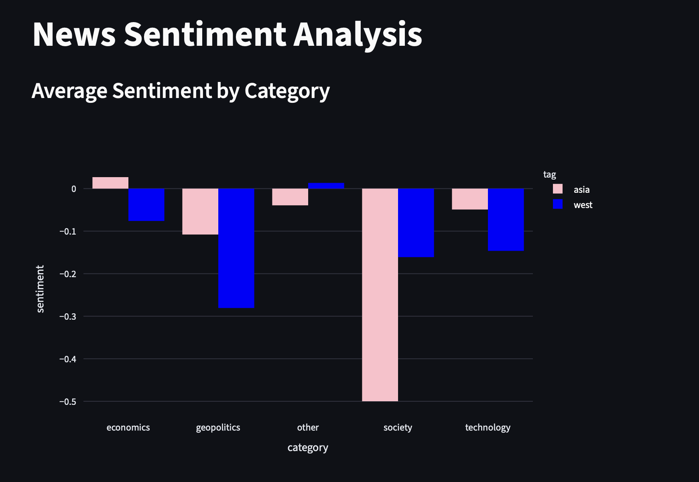
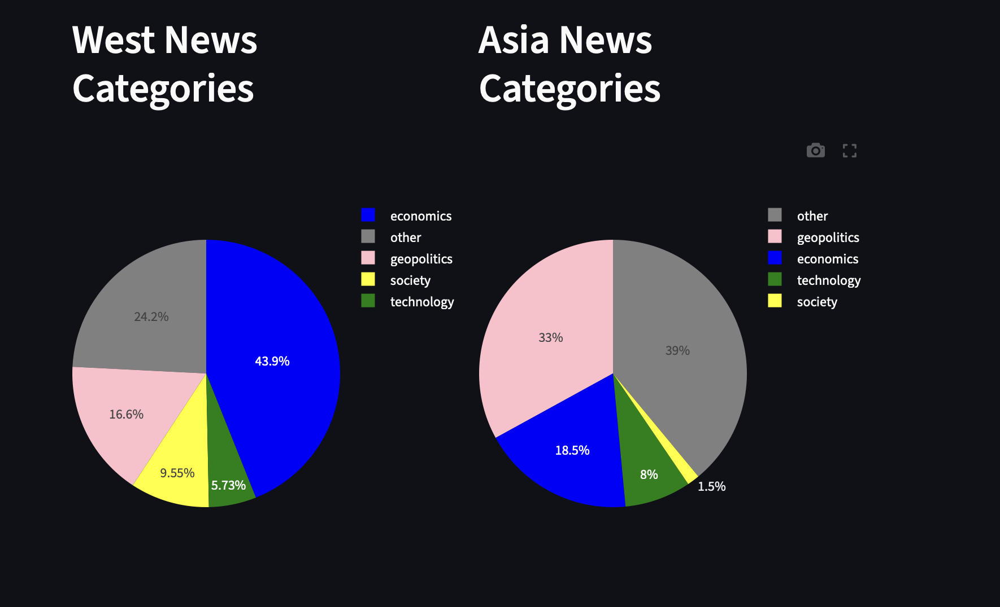
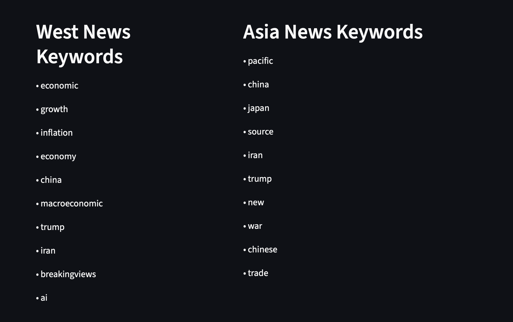

# Asia Media Lens 🌏

A web app for analyzing and comparing Western and Asian English-language media narratives on geopolitical and macroeconomic topics.

This is my seventh Python portfolio project, created during my self-directed learning process. It allowed me to go deeper into NLP, SQL, and data pipeline architecture.

---

## What it does

- Imports articles from 7 RSS feeds (BBC, Guardian, Reuters, SCMP, Nikkei Asia, Channel NewsAsia, The Diplomat)
- Cleans and stores articles in a SQLite database
- Runs NLP analysis: sentiment scoring (VADER) and named entity recognition (spaCy)
- Extracts TF-IDF keywords separately for Western and Asian sources
- Classifies each article into: geopolitics, economics, technology, society, or other
- Presents results in an interactive Streamlit dashboard

---

## Screenshots

---

## Technologies used

| Area | Tool |
|------|------|
| Language | Python 3.13 |
| UI | Streamlit |
| Database | SQLite |
| NLP | spaCy, scikit-learn (TF-IDF), VADER |
| Data handling | Pandas |
| Visualization | Plotly Express |
| RSS parsing | feedparser |

---

## How to run

1. Clone the repository
2. Create a virtual environment: `python -m venv .venv`
3. Install dependencies: `pip install -r requirements.txt`
4. Run in the following order:
   - `python db.py`
   - `python collector.py`
   - `python pipeline.py`
5. Launch the app: `streamlit run app.py`

---

## File structure

| File | Description |
|------|-------------|
| `db.py` | Database schema and all SQL queries |
| `collector.py` | RSS fetcher — collects and stores articles |
| `nlp.py` | Text cleaning, sentiment analysis, NER, TF-IDF |
| `classifier.py` | Keyword-based topic classification |
| `pipeline.py` | Runs NLP and classification on unprocessed articles |
| `app.py` | Streamlit dashboard |

---

## What I learned

This was my second project working with multiple modules, a SQL database, and a full data pipeline. It introduced me to TF-IDF and named entity recognition, and strengthened my understanding of how data flows through a multi-file Python application. I also learned how to structure a project so that each module has a single responsibility — making the code easier to debug and extend.

---

## Future development

- Replace keyword-based classification with a machine learning classifier 
- Add date filtering to track how narratives shift over time
- Automate data collection with a scheduler (e.g. APScheduler or cron)
- Add more RSS sources for broader geographic coverage
- Deploy to Streamlit Community Cloud